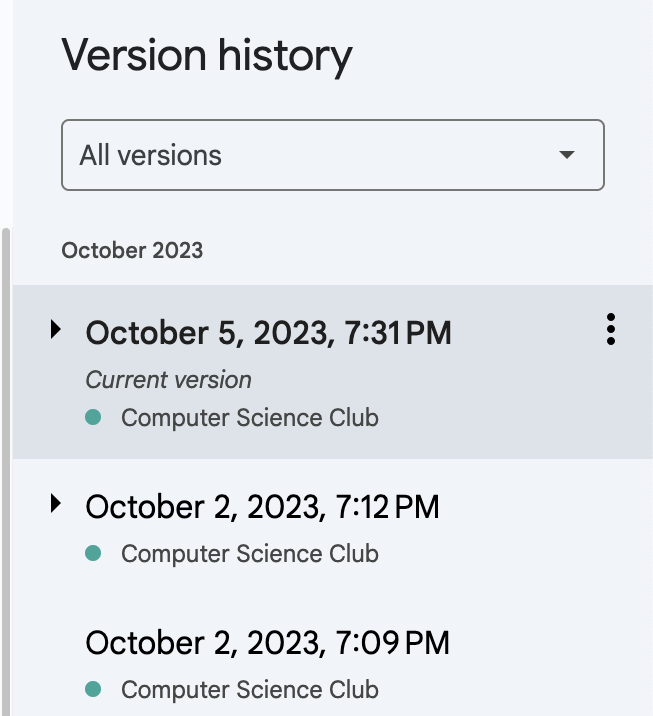

# CSPathway
An app to guide students though what classes to take
## Developing
### Git
We use GitHub to host the project, which is a Git hosting service. In order to start working on the project, you must use Git to clone the project. 
If you don't have any experience with Git, we recommend using the [GitHub Desktop app](https://desktop.github.com/download/) to give Git an easy-to-use interface.

To get started with this project, fork it!

You can then easily clone the project by clicking the green "Code" button on your fork's GitHub page and selecting "Open with GitHub Desktop".

You then need to select a location on your computer to save the project, and click "Clone".

You will then be asked how the fork will be used. You'll (hopefully!) be contributing back to the parent project.

Once cloned, you can open the project in your preferred code editor. If you do not have one already, we recommend using [Visual Studio Code](https://code.visualstudio.com/).

### Node.js
Both the backend and frontend of the project require Node.js to run. You can download Node.js from the [official website](https://nodejs.org/en/). Installation steps vary by operating system, but the default settings should work for most users.

## Running the Project
### Structure
There are 2 halves to this project. The frontend and the backend. The frontend is the website that is shown to users, and the backend is where all the computations are done.

Without a backend, the frontend won't be able to display any questions or pathways. Without a frontend, nobody will be able to talk to the backend. Both are necessary for the project to work.

### Backend

To run the backend, you should open a terminal in your code editor. Then, navigate to the backend folder of the project. You can do this by typing `cd backend` in the terminal.

Then, you should make sure all libraries are installed with `npm install`. 

Finally, you can start the backend with `node .`. This will start the backend on port 3000.

### Frontend

To run the frontend, open a second terminal in your code editor. Then, navigate to the frontend folder of the project. You can do this by typing `cd frontend` in the terminal.

Then, you should make sure all libraries are installed with `npm install`. 

Finally, you can start the frontend with `npm run dev`. This will start the frontend. It will provide you with a link to open the website in your browser.

### Making Changes

When you make a change to the backend, you will need to restart the backend for the changes to take effect. You can do this by pressing `Ctrl+C` in the terminal where the backend is running, and then running `node .` again.

When you make a change to the frontend, changes should appear automatically in your browser. If they do not, you can try refreshing the page. Make sure Auto Save is enabled in your code editor as well.

## Contributing

Once you have made changes to the project, you should commit your changes to Git. Think of a commit like a revision in the Google Docs version history menu. It's a snapshot of the project at a certain point in time.

To do this, go to the GitHub Desktop app and you should see a list of files that have changed. You can select the files you want to commit. You can also write a commit message to describe what you changed.

To upload your changes to GitHub, you should click "Push Origin" in GitHub Desktop. This will upload your changes to your fork of the project on GitHub.

Once you have finished your commits and changes, you should submit a "Pull Request". This is a request to add your changes to the main project. You can do this by clicking "Create Pull Request" in the "Branch" menu in GitHub Desktop.

A browser window will open, where you can write a description of your changes. You can also see a list of changes that you made.

After you hit submit, your changes are now able to be added to the project.